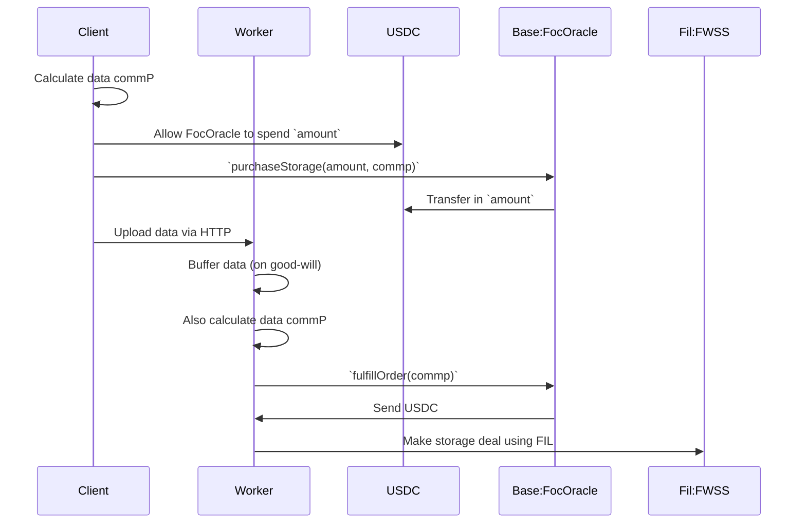

# foc-on-base
Deploying https://github.com/FilOzone/filecoin-services/ on base

## Approaches

### Deploy all of FOC on Base

✅

FOC contracts have been deployed on base.

❌

SPs aren't talking these contracts yet, therefore they aren't useful.

### Deploy FOC Oracle on Base

1. base client calls `FocOracle.purchaseStorage(commp)` on base
1. base client uploads data to oracle worker
1. Oracle worker creates storage deal on Filecoin

#### Client

See [./client/index.js](./client/index.js).

#### Contract

See [./contracts/src/FocOracle.sol](./contracts/src/FocOracle.sol).

#### Worker

See [./worker/index.js](./worker/index.js).

#### Storage flow

Note: There's lots to improve here, and lots of scenarios not yet considered. For example:
- It's assumed that there only ever is one order for a particular commP
- Orders should be validated and if necessary rejected
- Only the fulfiller should be allowed to fulfill orders
