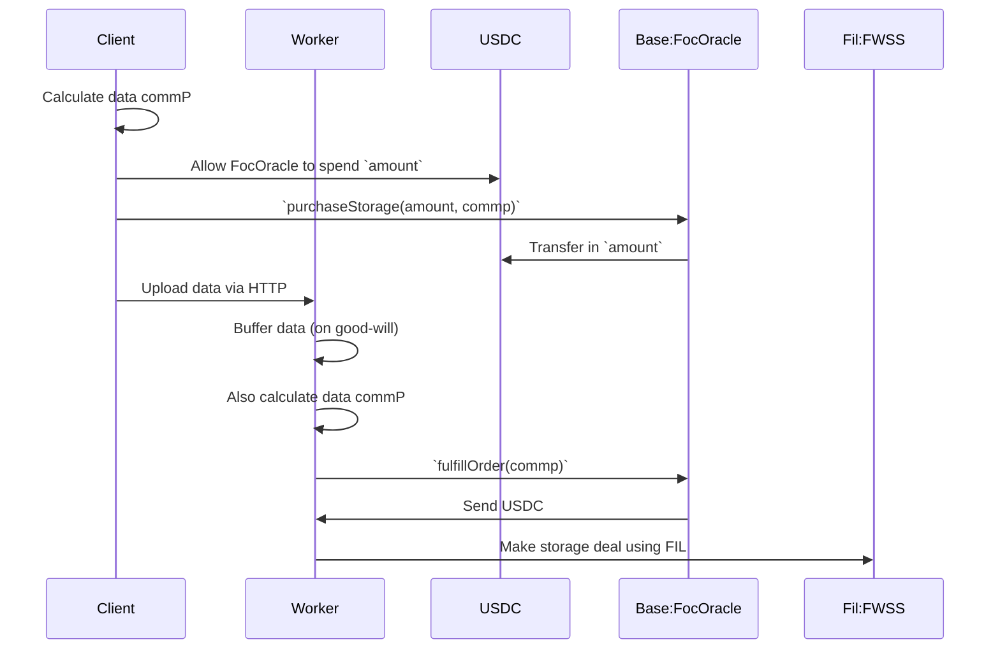

# foc-on-base
Deploying https://github.com/FilOzone/filecoin-services/ on base.

[Demo video](https://drive.google.com/file/d/1uwLOHXpDLy-7lqK_1v-kWQ3R9DCs127z/view?usp=sharing)

## Approaches

### Deploy all of FOC on Base

```json
"84532": {
  "SESSION_KEY_REGISTRY_ADDRESS": "0x6ea5108DB4B2d45e9b02Fc17c24c16844268d076",
  "metadata": {
    "commit": "d08214e1b3d200e0bc80f0d4f2e5ea3e1e4d603e",
    "deployed_at": "2026-03-24T11:44:40Z"
  },
  "SERVICE_PROVIDER_REGISTRY_IMPLEMENTATION_ADDRESS": "0x12115F80c932e435A59a2C25250e6d1a7C3e0D12",
  "SERVICE_PROVIDER_REGISTRY_PROXY_ADDRESS": "0xba83fD0e853c19c5d1B1ee8e13101FbA8e05A480",
  "SIGNATURE_VERIFICATION_LIB_ADDRESS": "0x600C88592191F69edd8A6c5455972f70B2B2e4cc",
  "FWSS_IMPLEMENTATION_ADDRESS": "0xfdfc1b8D4986968B12102a3956F4fb0a2b093beF",
  "FWSS_PROXY_ADDRESS": "0xE05f244264842C3C1186599e2b6DeB8d862F99cC",
  "FWSS_VIEW_ADDRESS": "0x2F4f85DE9606FF6d46836F80F4165787a4447375",
  "ENDORSEMENT_SET_ADDRESS": "0xDfd34d7A57Eb560ADc4Bbe5fB0f5FABd5416cc9e"
}
```

✅

FOC contracts have been deployed on base.

❌

SPs aren't talking these contracts yet, therefore they aren't useful.

### Deploy FOC Oracle on Base

1. base client calls `FocOracle.purchaseStorage(commp)` on base
1. base client uploads data to oracle worker
1. Oracle worker creates storage deal on Filecoin

#### Client

See [./client/index.js](./client/index.js).

#### Contract

See [./contracts/src/FocOracle.sol](./contracts/src/FocOracle.sol).

#### Worker

See [./worker/index.js](./worker/index.js).

#### Storage flow



Note: There's lots to improve here, and lots of scenarios not yet considered. For example:
- It's assumed that there only ever is one order for a particular commP
- Orders should be validated and if necessary rejected
- Only the fulfiller should be allowed to fulfill orders
